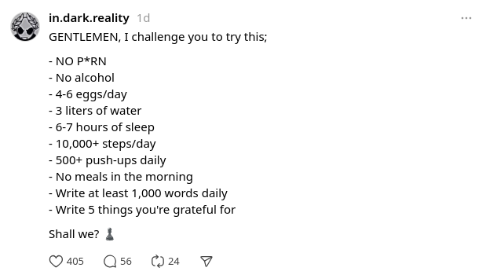

Hi, this is Shafat M. I am the owner of the thread handle ==@allthrusmartphone.== I am an ethical marketer, which means I can't promote everything that I come across just because it can make me money. I always think about my audience first. My mission for AllThruSmartphone is to help people learn, build, and run a business entirely through their smartphones. Threads is a new social media platform that can be used completely from a smartphone. I see that many people want to grow their Threads handles.Today, I discovered a Threads profile that has experienced significant growth in the past week. I took the time to analyze this profile and shared my findings with my audience. If you liked this document, please share the link.

 

Date of Analysis: 15-Nov-2024
Followers: 55k
ID: https://www.threads.net/@in.dark.reality

Channel's Mission: Helping others understand the dark psychology in the art of sales and persuasion. Showing dark manipulation tricks to be used and to avoid being manipulated

First post: 08-Oct-2024
Total posts to date: 185 
Posts on October: 17 posts
Posts on November (1-15): 168 posts

Growth started to skyrocket from November. He is claiming 50k in 5 days:
 

## Posts Frequency
### October (Total posts: 17)
08-Oct: 8 posts
09-Oct: 5 posts
11-Oct: 1 post
12-Oct: 1 post
29-Oct: 1 post
30-Oct: 1 post

### November (Total posts: 168)
01-Nov: 1 post
02-Nov: 1 post
03-Nov: 1 post
04-Nov: 2 posts
05-Nov: 3 posts
06-Nov: 2 posts
07-Nov: 1 post
08-Nov: 4 posts
09-Nov: 18 posts
10-Nov: 36 posts
11-Nov: 19 posts
12-Nov: 24 posts
13-Nov: 15 posts
14-Nov: 22 posts
15-Nov: 19 posts (the day hasn't end yet)

Posts with videos: 4
Posts with photos: 12 (_mostly screenshot of threads profile to show followers growth_)
Posts with numbers: 56 _(mostly tips and tricks_)
Posts with bullets: 27
Multi-thread posts: 5

Common posts: MOST FAMOUS DARK MANIPULATION TIPS 
(_I see many posts begins with an ALL CAPS sentence_)

Interestingly I _haven't_ found any post with _Call to Action_.

## Tools used
In one of his posts the author said he uses a few threads automation and AI tools for creating posts, commenting etc. 

Those tools are:
1. Thriendly
2. Blacktwist
3. Typefully
4. Typeshare
5. Ossa AI

## Some of his popular posts:
1.**Number Post:**
 

**2. Bullet Post:**
 

**3. Free Style Post:**
 

**4. Multi-Post Thread:**
 

**5. Post w/ Photo:**
 

**6. Top Engagement Post:**
 

While going through his recommended software I learned the following:

> 80% of Threads followers come from valuable comments to others posts.

So the posts are there to model and follow, but don't stop yourself from commenting on other people's post. Always share value so that people wants to visit your profile and give a follow. 

Thanks for reading the doc so far. 

~ Shafat M. (AllThruSmartphone)